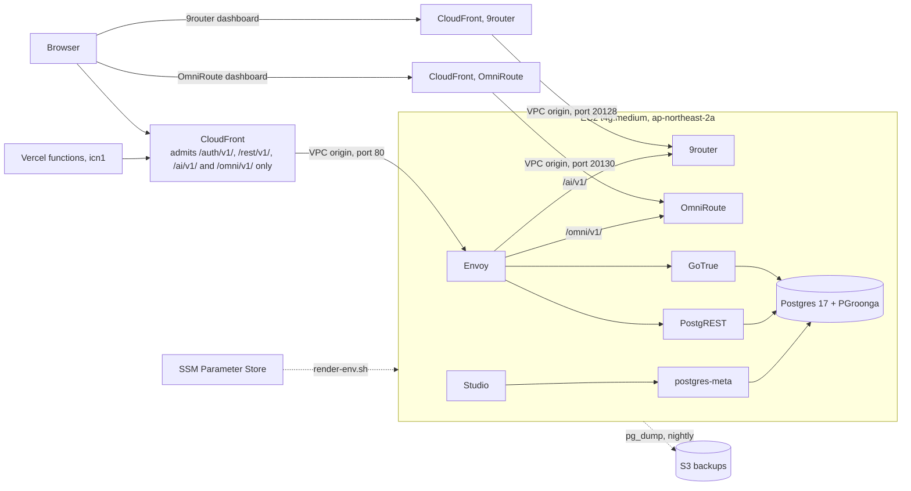

# infra

The database behind zhesen: a self-hosted Supabase on one EC2 instance in Seoul, reached
through CloudFront. Live since 2026-09-23. Everything in this folder is the source of
truth; nothing on the instance is edited by hand.



The instance has no open inbound port. CloudFront reaches Envoy and the two router dashboards
through VPC origins, the security group admits ports 80, 20128 and 20130 from their own security
group and nothing else, and the shell is SSM Session Manager. Secrets live in SSM Parameter Store and are
rendered into the instance's `.env` at boot.

Four AWS services carry the product: EC2 for the database host, S3 for the stack files
and the nightly dumps, CloudFront for the HTTPS edge, and SSM for parameters and the
shell. CloudWatch, SNS and Budgets only watch it. GoTrue sends no mail: accounts are email
plus password, confirmed at once, with no magic link and no password reset until there
are real users to serve.

## Layout

```
infra/
  terraform/                 the AWS account, one environment
    main.tf                  names, and the six module calls
    variables.tf             inputs; values in terraform.tfvars (git-ignored)
    outputs.tf               instance id, API URL, bucket names, tunnel commands
    versions.tf, backend.tf  Terraform and provider versions; state in S3, locked
    modules/
      instance/              the host: security group, EC2, IAM role, generated
                             secrets, the assets bucket, CloudWatch alarms, cloud-init
      edge/                  CloudFront: the API distribution with its path-allowlist
                             function, the 9router and OmniRoute distributions, their
                             VPC origins and ingress rules
      backup/                S3 bucket for the pg_dump files, 30-day expiry
      alerts/                SNS topic, HTTPS subscription, monthly budget
      settings/              SSM parameters carrying the API URL and bucket names
      vercel/                OIDC provider and the role the admin console uses: read
                             health, power the instance, SSM commands, rescue secret,
                             alert channels
  supabase/                  what runs on the instance, synced to /opt/zhesen/supabase
    docker-compose.yml       upstream compose trimmed to db, auth, rest, api-gw, studio, meta,
                             plus sampler
    sampler/                 sampler.py, host and container counters into Postgres every 5 s
    env.template             .env with ${SSM:/path} placeholders
    volumes/                 Envoy config and Postgres init scripts, copied from upstream
    bin/                     render-env.sh, backup.sh, migrate.sh, set-ai-cache-secret.sh, studio-tunnel.ps1
    UPSTREAM.md              upstream commit and every deviation from it
```

Each module has `main.tf` (or one file per concern in `instance/`), `variables.tf`,
`outputs.tf` and `versions.tf`, the layout HashiCorp documents for modules.
https://developer.hashicorp.com/terraform/language/modules/develop/structure

Two folders are named `supabase` on purpose. `supabase/` at the repository root is the
database schema: numbered SQL migrations that the app depends on, in the layout the
Supabase CLI uses. `infra/supabase/` is the server software that hosts that schema. The
first changes with the product, the second with the platform.

## Changing infra

1. Edit under `infra/` and open a pull request. `.github/workflows/infra.yml` runs
   `terraform fmt`, `terraform validate`, `shellcheck` on the scripts and
   `docker compose config`. It holds no AWS credentials, so it never plans or applies.
2. From the laptop: `terraform -chdir=infra/terraform plan`, read it, then `apply`.
   Terraform is at
   `C:\Users\Hiep\AppData\Local\Microsoft\WinGet\Packages\Hashicorp.Terraform_Microsoft.Winget.Source_8wekyb3d8bbwe\terraform.exe`.
3. A change under `infra/supabase/` lands in the assets bucket on apply, but the running
   instance only picks it up after a sync there:

```bash
cd /opt/zhesen/supabase
aws s3 sync s3://zhesen-infra-assets-<account>/supabase . --delete \
  --exclude '.env' --exclude 'volumes/db/data/*'
bin/render-env.sh   # only when env.template or an SSM parameter changed
bin/set-ai-cache-secret.sh   # after migration 0181 and after rotating /zhesen/prod/ai_cache_secret
docker compose -f docker-compose.yml --env-file .env up -d
```

Take a dump before an image tag bump. A Postgres major version is not an image bump;
upstream's `utils/upgrade-pg17.sh` is the pattern for that.

## Operating it

Shell: `aws ssm start-session --region ap-northeast-2 --target <instance_id>`, then
`sudo -i`. Compose lives in `/opt/zhesen/supabase`; `docker ps` shows seven containers,
because `studio` and `meta` are stopped to leave memory to the model routers.

Metrics: `zhesen-sampler` writes host and container counters to `admin.host_samples` every
5 s and keeps one hour. `/admin/infra` reads them through PostgREST and falls back to one SSM
command when the newest row is more than 20 s old. `docker logs zhesen-sampler` holds one line
per failed sample.

Studio: `docker compose start studio meta` on the instance, then
`pwsh infra/supabase/bin/studio-tunnel.ps1` and `http://localhost:8000`, user `zhesen`,
password in SSM `/zhesen/prod/dashboard_password`. Stop both again afterwards. A
`docker compose up -d` that names no service, as a deploy runs it, starts them too.

9router: the assistant's model router, container `zhesen-9router`. The app calls
`https://<cloudfront>/ai/v1/` with a 9router API key held in SSM `/zhesen/prod/ai_api_key`.
Its dashboard has its own distribution (`terraform output router_url`), guarded only by
9router's login. `/admin/router` shows that link, the password (SSM
`/zhesen/prod/router_password`) and the combo the assistant uses. The password reaches 9router
as `INITIAL_PASSWORD`, and the service's entrypoint drops any password 9router stored itself on
every start, so change it on `/admin/secrets`, not in the dashboard. Without the app: `pwsh
infra/supabase/bin/router-tunnel.ps1`, then `http://localhost:20128/dashboard`. Provider logins
and keys live in `/opt/zhesen/9router/db/data.sqlite`, which the nightly backup copies to
`9router/`.

OmniRoute: the second model router, container `zhesen-omniroute`, asked only when 9router
fails (`lib/ai/client.ts`). The app calls `https://<cloudfront>/omni/v1/` with an OmniRoute API
key held in SSM `/zhesen/prod/ai_fallback_api_key` and the model `zhesen`, a combo of DeepSeek
web models. Its dashboard has its own distribution (`terraform output omniroute_url`), guarded
by OmniRoute's login; the password is SSM `/zhesen/prod/omniroute_password`, applied the same
way as 9router's. Provider logins live encrypted in `/opt/zhesen/omniroute/data/storage.sqlite`
under SSM `/zhesen/prod/omniroute_storage_key`, which cannot be rotated without losing them.
The nightly backup copies that file to `omniroute/`. Table retention is a dashboard setting stored
in that file (Settings, Database, or `PATCH /api/settings/database`): call logs 2 days, quota
snapshots and compression analytics 3, usage history 30. OmniRoute's defaults are 90, 90, 30 and
365, and its cleanup runs every 6 hours with a `VACUUM` after it.

Backup: `bin/backup.sh` at 03:30 UTC writes `pg_dump -Fc` plus `pg_dumpall --globals-only`
to `s3://zhesen-db-backups-<account>/postgres/`, and copies of the 9router and OmniRoute
databases to `9router/` and `omniroute/`, all kept 30 days; a failure posts to SNS. Only the newest
set stays in `/var/backups/zhesen`. Restore 9router by stopping
`zhesen-9router` and putting the file back as `/opt/zhesen/9router/db/data.sqlite`.
The root volume outlives the instance (`delete_on_termination = false`), so a dead host
is rebuilt around the same volume; there is no volume snapshot.

Restore a dump into the running database:

```bash
aws s3 cp s3://zhesen-db-backups-<account>/postgres/postgres-<stamp>.dump /tmp/
docker cp /tmp/postgres-<stamp>.dump supabase-db:/tmp/restore.dump
docker exec -i supabase-db pg_restore -U supabase_admin -d postgres --clean --if-exists /tmp/restore.dump
```

Resize: Change type on `/admin/infra` stops the instance, sets the type and starts it,
about 2 to 3 minutes down. Terraform ignores `instance_type`, so an apply does not revert it;
`instance_type` in `terraform.tfvars` only applies to a rebuilt instance. Volume, private IP and
instance id survive. More memory means raising `shared_buffers` and `effective_cache_size` in
`docker-compose.yml`.

Alarms (CPU, CPU credits, memory, disk, status checks), the 45 USD budget and a failed
backup publish to SNS topic `zhesen-alerts`. Its one subscriber is the HTTPS endpoint
`/api/alerts/sns` on the production deployment, which verifies each message's signature,
confirms the subscription itself, and forwards to the Slack webhook and Telegram chat set
under Alerts on `/admin/infra`. Admin actions go to the same channels directly. The channels
live in the SecureString `/zhesen/prod/alert_channels`, written by that page, never by
Terraform. Deploy the endpoint before the apply that creates the subscription: SNS sends
the confirmation once.

## Rebuilding from nothing

```bash
cp infra/terraform/terraform.tfvars.example infra/terraform/terraform.tfvars
terraform -chdir=infra/terraform init && terraform -chdir=infra/terraform apply
```

Three SSM parameters are read, not created: `/zhesen/prod/jwt_secret`,
`/zhesen/prod/anon_key`, `/zhesen/prod/service_role_key`. Rewriting `jwt_secret` would
invalidate the anon key the app ships, so it stays out of Terraform. If the first apply
stops with "no matching EC2 Security Group found", CloudFront had not yet created the VPC
origin's group: apply again. Cloud-init is done when `/var/lib/cloud/zhesen-ready`
exists (about 5 minutes, plus up to 20 for the CloudFront URL on a first apply); its log
is `/var/log/zhesen-cloud-init.log`. Then restore the latest dump and set the alert
channels on `/admin/infra`.

## Migration and cutover, 2026-09-23

`bin/migrate.sh` moved the data from the Supabase Cloud project: `preflight`, `full`
(schema, data, the triggers and role settings `pg_dump -n` omits, then `verify`),
`resync-users --force` at cutover for the auth and public rows written in between.
`verify` compares every table count, the md5 of `lex.entries` ids, policies, triggers and
two searches against Cloud, and all of it matched. Vercel and the GitHub Actions secrets
then received the CloudFront URL and the legacy anon JWT; the auth cookie name is pinned
in `lib/supabase/env.ts`, so sessions carried over.

Rollback until 2026-10-23: point the two Vercel variables back at the Cloud project and
the `sb_publishable_` key and redeploy. Rows written after the cutover stay on the
instance. The Cloud project's legacy `anon` and `service_role` JWTs were disabled on
2026-09-28 (#32); the rollback does not use them. The migration role and `/zhesen/migration/cloud_db_url` were removed, so
`migrate.sh` can no longer read Cloud without recreating both.

## Cost

| Item | USD per month |
| --- | --- |
| t4g.medium | 30.37 |
| gp3, 30 GB | 2.74 |
| Public IPv4 address | 3.65 |
| CloudFront, S3, SNS | under 1.00 |
| Total | about 37, paid from AWS credits |
