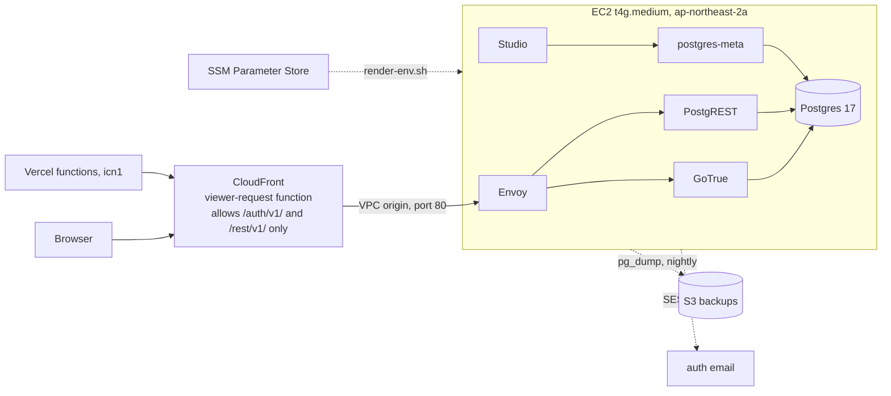

# infra

Self-hosted Supabase for zhesen: one EC2 instance in Seoul behind CloudFront.
`infra/terraform` builds the account; `infra/supabase` is what the instance runs.



CloudFront reaches Envoy through a VPC origin: an ENI inside the VPC, so the hop
never crosses the public internet. The security group admits port 80 from the
VPC origin's service-managed security group and nothing else, which also keeps
other AWS customers' distributions out. The instance has a public address for
egress only; nothing answers on it. There is no SSH key and no open SSH port; the
shell is SSM Session Manager. Studio is reachable only through a port-forwarding
tunnel.

## Prerequisites

- AWS CLI v2, credentials for account 014498663963.
- Terraform 1.10 or later. It is not on PATH on this laptop:
  `C:\Users\Hiep\AppData\Local\Microsoft\WinGet\Packages\Hashicorp.Terraform_Microsoft.Winget.Source_8wekyb3d8bbwe\terraform.exe`.
- The Session Manager plugin, for `aws ssm start-session`.

## First apply

```bash
cp infra/terraform/terraform.tfvars.example infra/terraform/terraform.tfvars
# fill in alert_email and ses_sender_email
terraform -chdir=infra/terraform init
terraform -chdir=infra/terraform plan
terraform -chdir=infra/terraform apply
```

Four SSM parameters are read, not created: `/zhesen/prod/jwt_secret`,
`/zhesen/prod/anon_key`, `/zhesen/prod/service_role_key` and
`/zhesen/migration/cloud_db_url`. The apply fails if any is missing. Rewriting
`jwt_secret` would invalidate the anon key the app ships, so it stays out of
Terraform.

CloudFront creates the `CloudFront-VPCOrigins-Service-SG` group while the VPC
origin deploys. If the first apply stops with "no matching EC2 Security Group
found", the group was not there yet: run `apply` again and it completes.

Afterwards, confirm the SNS subscription email and the SES identity verification
email. Both arrive at `ses_sender_email`.

Cloud-init takes about five minutes, then waits for the URL parameters, which
Terraform writes once the CloudFront distribution exists (up to 20 minutes on a
first apply). It is done when `/var/lib/cloud/zhesen-ready` exists; the log is
`/var/log/zhesen-cloud-init.log`.

## Studio

```bash
pwsh infra/supabase/bin/studio-tunnel.ps1
```

Studio is then at `http://localhost:8000`, behind the basic-auth user `zhesen`
whose password is `/zhesen/prod/dashboard_password`.

## Migration

```bash
aws ssm start-session --region ap-northeast-2 --target "$(terraform -chdir=infra/terraform output -raw instance_id)"
sudo -i
/opt/zhesen/supabase/bin/migrate.sh preflight
/opt/zhesen/supabase/bin/migrate.sh full
```

`preflight` refuses to run if the target already holds data, and refuses if the
local GoTrue is behind the Cloud auth schema. `full` restores schema then data,
recreates the two triggers and the role settings `pg_dump -n` leaves behind, and
finishes by running `verify`. `resync-users --force` truncates the auth and public
tables and reloads them from Cloud, for the cutover after a rehearsal; it never
touches `lex` or `public.languages`. `verify` prints Cloud and local counts side
by side and exits non-zero on any mismatch.

## Backups

Two independent copies:

- DLM snapshots the root volume daily at 03:00 UTC and keeps seven.
- `bin/backup.sh` runs at 03:30 UTC, writes a `pg_dump -Fc` and a
  `pg_dumpall --globals-only` to `s3://zhesen-db-backups-<account>/postgres/`,
  and keeps them for 30 days.

To restore a dump into the running instance:

```bash
aws s3 cp s3://zhesen-db-backups-<account>/postgres/postgres-<stamp>.dump /tmp/
docker cp /tmp/postgres-<stamp>.dump supabase-db:/tmp/restore.dump
docker exec -i supabase-db pg_restore -U supabase_admin -d postgres --clean --if-exists /tmp/restore.dump
```

To restore the whole host, create a volume from the snapshot and attach it as the
root device of a replacement instance, then re-apply so the VPC origin points at
the new instance.

## Resizing

```bash
docker compose -f /opt/zhesen/supabase/docker-compose.yml --env-file /opt/zhesen/supabase/.env down
```

Stop the instance, change `instance_type` in `terraform.tfvars`, apply, start it.
The volume, the private IP and the instance id survive. If the new size has more
memory, raise `shared_buffers` and `effective_cache_size` in `docker-compose.yml`
to match.

## Upgrading an image tag

Snapshot first: `aws ec2 create-snapshot` on the root volume, or wait for the
03:00 UTC one. Then edit the tag in `docker-compose.yml`, apply so the object
lands in the assets bucket, and on the instance:

```bash
aws s3 sync s3://zhesen-infra-assets-<account>/supabase /opt/zhesen/supabase --delete \
  --exclude '.env' --exclude 'volumes/db/data/*'
docker compose -f /opt/zhesen/supabase/docker-compose.yml --env-file /opt/zhesen/supabase/.env up -d
```

A Postgres major version is not an image bump. Upstream's `utils/upgrade-pg17.sh`
is the pattern for that.

## Cost

| Item | USD per month |
| --- | --- |
| t4g.medium | 30.37 |
| gp3, 30 GB | 2.74 |
| Public IPv4 address | 3.65 |
| EBS snapshots | about 1.50 |
| CloudFront, S3, SNS, SES | under 1.00 |
| Total | about 38 |

## Cutover

1. `migrate.sh full`, then read the `verify` summary.
2. Set `NEXT_PUBLIC_SUPABASE_URL` on Vercel to the `api_url` output, and
   `NEXT_PUBLIC_SUPABASE_ANON_KEY` to the legacy anon JWT, not the
   `sb_publishable_` key.
3. Redeploy. The auth cookie name is pinned in `lib/supabase/env.ts`, so sessions
   carry over.
4. `migrate.sh resync-users --force` picks up anything written to Cloud between
   the dump and the redeploy.

Rollback is step 2 in reverse: point the two Vercel variables back at the Cloud
project URL and the `sb_publishable_` key, and redeploy. Nothing on the instance
has to be undone, and the Cloud project is untouched throughout.
