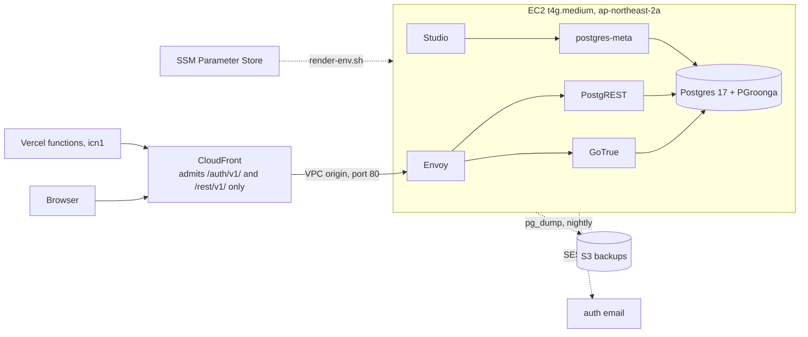

# infra

The database behind zhesen: a self-hosted Supabase on one EC2 instance in Seoul, reached
through CloudFront. Live since 2026-09-23. Everything in this folder is the source of
truth; nothing on the instance is edited by hand.



The instance has no open inbound port. CloudFront reaches Envoy through a VPC origin,
the security group admits port 80 from that origin's own security group and nothing
else, and the shell is SSM Session Manager. Secrets live in SSM Parameter Store and are
rendered into the instance's `.env` at boot.

## Layout

```
infra/
  terraform/            the AWS account, one root module, one environment
    versions.tf         Terraform and provider versions
    backend.tf          state in S3, locked
    variables.tf        inputs; values in terraform.tfvars (git-ignored)
    locals.tf           names and the file list synced to the instance
    network.tf          security group
    ec2.tf              the instance and its root volume
    templates/          cloud-init: install Docker, sync the stack, render .env, start
    iam.tf              instance role (SSM, CloudWatch, read own parameters)
    secrets.tf          generated passwords and config, written to SSM
    ses.tf              email identity and SMTP credentials for auth mail
    cloudfront.tf       distribution, VPC origin, path-allowlist function
    storage.tf          S3: stack files for the instance, database dumps
    backup.tf           daily EBS snapshots
    monitoring.tf       CloudWatch alarms, SNS topic, budget
    outputs.tf          instance id, API URL, bucket names, tunnel commands
  supabase/             what runs on the instance, synced to /opt/zhesen/supabase
    docker-compose.yml  upstream compose trimmed to db, auth, rest, api-gw, studio, meta
    env.template        .env with ${SSM:/path} placeholders
    volumes/            Envoy config and Postgres init scripts, copied from upstream
    bin/                render-env.sh, backup.sh, migrate.sh, studio-tunnel.ps1
    UPSTREAM.md         upstream commit and every deviation from it
```

Two folders are named `supabase` on purpose. `supabase/` at the repository root is the
database schema: numbered SQL migrations that the app depends on, in the layout the
Supabase CLI uses. `infra/supabase/` is the server software that hosts that schema. The
first changes with the product, the second with the platform.

Terraform stays one flat root module by concern, which is HashiCorp's standard layout
for a single environment; modules earn their place only when a piece is instantiated
twice. https://developer.hashicorp.com/terraform/language/modules/develop/structure

## Changing infra

1. Edit under `infra/` and open a pull request. `.github/workflows/infra.yml` runs
   `terraform fmt`, `terraform validate`, `shellcheck` on the scripts and
   `docker compose config`. It holds no AWS credentials, so it never plans or applies.
2. From the laptop: `terraform -chdir=infra/terraform plan`, read it, then `apply`.
   Terraform is at
   `C:\Users\Hiep\AppData\Local\Microsoft\WinGet\Packages\Hashicorp.Terraform_Microsoft.Winget.Source_8wekyb3d8bbwe\terraform.exe`.
3. A change under `infra/supabase/` lands in the assets bucket on apply, but the running
   instance only picks it up after a sync there:

```bash
aws s3 sync s3://zhesen-infra-assets-<account>/supabase /opt/zhesen/supabase --delete \
  --exclude '.env' --exclude 'volumes/db/data/*'
docker compose -f /opt/zhesen/supabase/docker-compose.yml --env-file /opt/zhesen/supabase/.env up -d
```

Snapshot the root volume before an image tag bump. A Postgres major version is not an
image bump; upstream's `utils/upgrade-pg17.sh` is the pattern for that.

## Operating it

Shell: `aws ssm start-session --region ap-northeast-2 --target <instance_id>`, then
`sudo -i`. Compose lives in `/opt/zhesen/supabase`; `docker ps` shows six containers.

Studio: `pwsh infra/supabase/bin/studio-tunnel.ps1`, then `http://localhost:8000`, user
`zhesen`, password in SSM `/zhesen/prod/dashboard_password`.

Backups, two independent copies:

- DLM snapshots the root volume daily at 03:00 UTC and keeps seven.
- `bin/backup.sh` at 03:30 UTC writes `pg_dump -Fc` plus `pg_dumpall --globals-only` to
  `s3://zhesen-db-backups-<account>/postgres/`, kept 30 days; a failure posts to SNS.

Restore a dump into the running database:

```bash
aws s3 cp s3://zhesen-db-backups-<account>/postgres/postgres-<stamp>.dump /tmp/
docker cp /tmp/postgres-<stamp>.dump supabase-db:/tmp/restore.dump
docker exec -i supabase-db pg_restore -U supabase_admin -d postgres --clean --if-exists /tmp/restore.dump
```

Restore the host: create a volume from a snapshot, attach it as the root device of a
replacement instance, re-apply so the VPC origin points at it.

Resize: `docker compose down` on the instance, stop it, change `instance_type` in
`terraform.tfvars`, apply, start. Volume, private IP and instance id survive. More
memory means raising `shared_buffers` and `effective_cache_size` in `docker-compose.yml`.

Alarms (CPU, CPU credits, memory, disk, status checks) and the 45 USD budget email
`alert_email` through SNS topic `zhesen-alerts`, once the subscription is confirmed.

## Rebuilding from nothing

```bash
cp infra/terraform/terraform.tfvars.example infra/terraform/terraform.tfvars   # two emails
terraform -chdir=infra/terraform init && terraform -chdir=infra/terraform apply
```

Three SSM parameters are read, not created: `/zhesen/prod/jwt_secret`,
`/zhesen/prod/anon_key`, `/zhesen/prod/service_role_key`. Rewriting `jwt_secret` would
invalidate the anon key the app ships, so it stays out of Terraform. If the first apply
stops with "no matching EC2 Security Group found", CloudFront had not yet created the VPC
origin's group: apply again. Cloud-init is done when `/var/lib/cloud/zhesen-ready`
exists (about 5 minutes, plus up to 20 for the CloudFront URL on a first apply); its log
is `/var/log/zhesen-cloud-init.log`. Then confirm the SNS and SES emails.

## Migration and cutover, 2026-09-23

`bin/migrate.sh` moved the data from the Supabase Cloud project: `preflight`, `full`
(schema, data, the triggers and role settings `pg_dump -n` omits, then `verify`),
`resync-users --force` at cutover for the auth and public rows written in between.
`verify` compares every table count, the md5 of `lex.entries` ids, policies, triggers and
two searches against Cloud, and all of it matched. Vercel and the GitHub Actions secrets
then received the CloudFront URL and the legacy anon JWT; the auth cookie name is pinned
in `lib/supabase/env.ts`, so sessions carried over.

Rollback until 2026-10-23: point the two Vercel variables back at the Cloud project and
the `sb_publishable_` key and redeploy. Rows written after the cutover stay on the
instance. The migration role and `/zhesen/migration/cloud_db_url` were removed, so
`migrate.sh` can no longer read Cloud without recreating both.

## Cost

| Item | USD per month |
| --- | --- |
| t4g.medium | 30.37 |
| gp3, 30 GB | 2.74 |
| Public IPv4 address | 3.65 |
| EBS snapshots | about 1.50 |
| CloudFront, S3, SNS, SES | under 1.00 |
| Total | about 38, paid from AWS credits |
